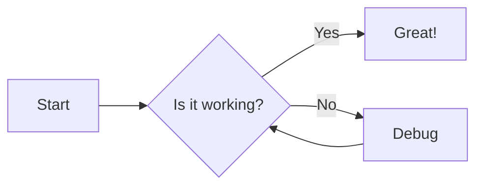

# Welcome to MkDocs

For full documentation visit [mkdocs.org](https://www.mkdocs.org).

## Commands

* `mkdocs new [dir-name]` - Create a new project.
* `mkdocs serve` - Start the live-reloading docs server.
* `mkdocs build` - Build the documentation site.
* `mkdocs -h` - Print help message and exit.

## Project layout

    mkdocs.yml    # The configuration file.
    docs/
        index.md  # The documentation homepage.
        ...       # Other markdown pages, images and other files.


This is your documentation home page.

## Quick Start

Get started with our [Getting Started Guide](getting-started.md).
```

### Step 3: Fix DNS (Do This First!)

1. Go to your domain registrar/DNS provider
2. Add the CNAME record as shown above
3. Wait 5-30 minutes for DNS propagation
4. Click "Check again" in GitHub Pages settings

### Step 4: Create CNAME File

After DNS is working, create a file named `CNAME` in your `docs/` folder:
```
doc.kaboli.xyz


!!! note "Important Note"
    This is a note admonition.

!!! warning
    This is a warning without custom title.

!!! tip "Pro Tip"
    Use these for helpful hints!


=== "Python"
```python
    def hello():
        print("Hello")
```

=== "JavaScript"
```javascript
    function hello() {
        console.log("Hello");
    }
```

# Advanced MkDocs Tips & Tricks

A comprehensive guide to getting the most out of MkDocs and Material for MkDocs.

## Search Optimization

### Exclude Pages from Search

Configure which pages should be excluded from search results:

```yaml
# mkdocs.yml
plugins:
  - search:
      exclude:
        - tags.md
        - archive/*
```

### Boost Search Ranking

Make important pages rank higher in search results by adding frontmatter:

```markdown
---
search:
  boost: 2
---
# Important Page
```

## Auto-Generated API Documentation

For Python projects, use `mkdocstrings` to automatically generate API documentation from docstrings:

```bash
pip install mkdocstrings[python]
```

```yaml
# mkdocs.yml
plugins:
  - mkdocstrings:
      handlers:
        python:
          options:
            show_source: true
            show_root_heading: true
```

Then in your markdown files:

```markdown
::: your_module.your_class
    options:
      show_source: true
      members_order: source
```

## Version Management

Use `mike` for managing multiple documentation versions with a dropdown selector:

```bash
pip install mike

# Deploy version 1.0
mike deploy --push --update-aliases 1.0 latest

# Deploy version 2.0
mike deploy --push --update-aliases 2.0 latest
```

```yaml
# mkdocs.yml
extra:
  version:
    provider: mike
```

## Content Tabs with Memory

Enable tabs that remember user's language preference across pages:

```yaml
# mkdocs.yml
markdown_extensions:
  - pymdownx.tabbed:
      alternate_style: true
      slugify: !!python/object/apply:pymdownx.slugs.slugify
        kwds:
          case: lower
```

Example usage:

````markdown
=== "Python"

    ```python
    print("Hello, World!")
    ```

=== "JavaScript"

    ```javascript
    console.log("Hello, World!");
    ```

=== "Rust"

    ```rust
    println!("Hello, World!");
    ```
````

## Mermaid Diagrams

Add support for Mermaid diagrams directly in your markdown:

```yaml
# mkdocs.yml
markdown_extensions:
  - pymdownx.superfences:
      custom_fences:
        - name: mermaid
          class: mermaid
          format: !!python/name:pymdownx.superfences.fence_code_format
```

Example diagram:

````markdown

````

## Interactive Code Annotations

Add numbered annotations to code blocks that show on hover:

````markdown
```python
def greet(name: str) -> str:
    return f"Hello {name}!"  # (1)
```

1. This is an annotation that appears on hover!
````

## Include External Files

Include content from external files using snippets:

```yaml
# mkdocs.yml
markdown_extensions:
  - pymdownx.snippets:
      base_path: .
```

Usage examples:

```markdown
<!-- Include entire file -->
--8<-- "README.md"

<!-- Include specific lines (10-20) -->
--8<-- "src/example.py:10:20"

<!-- Include from line 10 to end -->
--8<-- "src/example.py:10:"
```

## Custom Homepage

Create a custom homepage with cards by adding a custom directory:

```yaml
# mkdocs.yml
theme:
  features:
    - content.action.edit
  custom_dir: overrides
```

Create `overrides/home.html`:

```html



<div class="md-typeset">
  <h1>Welcome to Our Documentation!</h1>
  <div class="grid cards">
    <a href="{{ 'getting-started/' | url }}" class="card">
      <h2>📚 Getting Started</h2>
      <p>New to the project? Start here!</p>
    </a>
    <a href="{{ 'api/' | url }}" class="card">
      <h2>🔧 API Reference</h2>
      <p>Complete API documentation</p>
    </a>
    <a href="{{ 'examples/' | url }}" class="card">
      <h2>💡 Examples</h2>
      <p>Learn by example</p>
    </a>
  </div>
</div>

```

## Git Integration

### Show Contributors

```yaml
plugins:
  - git-committers:
      repository: yourusername/yourrepo
      branch: main
```

### Show Last Updated Date

```yaml
plugins:
  - git-revision-date-localized:
      enable_creation_date: true
      type: timeago
```

## Social Cards

Automatically generate Open Graph images for social media sharing:

```yaml
plugins:
  - social:
      cards_layout: default/variant
```

## Custom 404 Page

Create `docs/404.md`:

```markdown
---
hide:
  - navigation
  - toc
---

# 404 - Page Not Found

😕 The page you're looking for doesn't exist.

[Go to Homepage](/){ .md-button .md-button--primary }
```

## Task Lists & Progress Indicators

```markdown
## Project Status

- [x] Write documentation
- [x] Add examples
- [ ] Create video tutorial
- [ ] Add translations

!!! progress "Documentation Progress"
    Documentation is **80% complete**
```

## Blog Plugin

Add a blog section for news and updates:

```yaml
plugins:
  - blog:
      blog_dir: blog
      post_dir: "{blog}/posts"
      post_date_format: medium
      archive: true
      categories: true
```

## Keyboard Keys Styling

```yaml
markdown_extensions:
  - pymdownx.keys
```

Usage:

```markdown
Press ++ctrl+alt+del++ to restart

Common shortcuts:
- ++cmd+c++ : Copy
- ++cmd+v++ : Paste
- ++ctrl+shift+i++ : Open Developer Tools
```

## Environment-Specific Configurations

Create multiple configuration files:

```yaml
# mkdocs.yml (base configuration)
site_name: My Project
theme:
  name: material

# mkdocs.dev.yml (development)
INHERIT: mkdocs.yml
site_url: http://localhost:8000
strict: false

# mkdocs.prod.yml (production)
INHERIT: mkdocs.yml
site_url: https://doc.kaboli.xyz
strict: true
```

Usage:

```bash
# Development
mkdocs serve -f mkdocs.dev.yml

# Production build
mkdocs build -f mkdocs.prod.yml
```

## Copy Button for Code Blocks

```yaml
theme:
  features:
    - content.code.copy
    - content.code.select  # Allow selecting specific lines
    - content.code.annotate  # Enable annotations
```

## URL Redirects

Handle moved or renamed pages gracefully:

```yaml
plugins:
  - redirects:
      redirect_maps:
        'old-page.md': 'new-page.md'
        'guide/old.md': 'guide/new.md'
        'deprecated.md': 'https://external-site.com'
```

## Math Support (LaTeX)

```yaml
markdown_extensions:
  - pymdownx.arithmatex:
      generic: true

extra_javascript:
  - javascripts/mathjax.js
  - https://polyfill.io/v3/polyfill.min.js?features=es6
  - https://cdn.jsdelivr.net/npm/mathjax@3/es5/tex-mml-chtml.js
```

Create `docs/javascripts/mathjax.js`:

```javascript
window.MathJax = {
  tex: {
    inlineMath: [["\\(", "\\)"]],
    displayMath: [["\\[", "\\]"]],
    processEscapes: true,
    processEnvironments: true
  },
  options: {
    ignoreHtmlClass: ".*|",
    processHtmlClass: "arithmatex"
  }
};
```

Usage:

```markdown
Inline math: $\sqrt{x^2 + y^2}$

Display math:

$$
E = mc^2
$$
```

## Analytics with Feedback

```yaml
extra:
  analytics:
    provider: google
    property: G-XXXXXXXXXX
    feedback:
      title: Was this page helpful?
      ratings:
        - icon: material/emoticon-happy-outline
          name: This page was helpful
          data: 1
          note: Thanks for your feedback!
        - icon: material/emoticon-sad-outline
          name: This page could be improved
          data: 0
          note: Help us improve by filing an issue.
```

## Development Workflow Tips

### Useful Commands

```bash
# Live reload with dirty reload (faster)
mkdocs serve --dirtyreload

# Verbose output for debugging
mkdocs serve --verbose

# Build with strict mode (fails on warnings)
mkdocs build --strict

# Clean build
mkdocs build --clean

# Preview production build
python -m http.server 8000 --directory site
```

### Pre-commit Hooks

Create `.pre-commit-config.yaml`:

```yaml
repos:
  - repo: https://github.com/pre-commit/pre-commit-hooks
    rev: v4.4.0
    hooks:
      - id: check-yaml
      - id: end-of-file-fixer
      - id: trailing-whitespace
  - repo: local
    hooks:
      - id: mkdocs-build
        name: Build MkDocs
        entry: mkdocs build --strict
        language: system
        pass_filenames: false
```

## Custom Variables

Define reusable variables:

```yaml
# mkdocs.yml
extra:
  version: 1.2.3
  company: YourCompany
  github_repo: https://github.com/yourusername/yourrepo
```

Use in markdown:

```markdown
Current version: {{ config.extra.version }}

© 2024 {{ config.extra.company }}

[View on GitHub]({{ config.extra.github_repo }})
```

## Performance Optimization

```yaml
plugins:
  - minify:
      minify_html: true
      minify_js: true
      minify_css: true
      htmlmin_opts:
        remove_comments: true
  - optimize:
      enabled: !ENV [OPTIMIZE, true]
```

## Admonitions (Callout Boxes)

Enable various types of callout boxes:

```yaml
markdown_extensions:
  - admonition
  - pymdownx.details
  - pymdownx.superfences
```

Usage examples:

```markdown
!!! note "Custom Title"
    This is a note with a custom title.

!!! warning
    This is a warning without a custom title.

!!! tip "Pro Tip"
    Use these callouts to highlight important information!

!!! danger "Critical"
    This is for critical warnings.

??? question "Collapsible Question"
    This is a collapsible section that starts closed.

???+ example "Expanded by Default"
    This collapsible section starts open.
```

## Advanced Theme Customization

```yaml
theme:
  name: material
  palette:
    # Light mode
    - scheme: default
      primary: indigo
      accent: indigo
      toggle:
        icon: material/brightness-7
        name: Switch to dark mode
    # Dark mode
    - scheme: slate
      primary: indigo
      accent: indigo
      toggle:
        icon: material/brightness-4
        name: Switch to light mode
  features:
    # Navigation
    - navigation.instant
    - navigation.tracking
    - navigation.tabs
    - navigation.tabs.sticky
    - navigation.sections
    - navigation.expand
    - navigation.path
    - navigation.prune
    - navigation.indexes
    - navigation.top
    - toc.follow
    - toc.integrate
    # Search
    - search.suggest
    - search.highlight
    - search.share
    # Content
    - content.code.copy
    - content.code.select
    - content.code.annotate
    - content.tabs.link
    - content.tooltips
    # Header
    - header.autohide
    - announce.dismiss
```

## Tips for Writing Better Documentation

### Use Descriptive Headers
- Use clear, action-oriented headers
- Keep headers concise but descriptive
- Use proper hierarchy (don't skip levels)

### Provide Context
- Start each page with a brief overview
- Explain why something matters before how to do it
- Link to related documentation

### Include Examples
- Show real-world use cases
- Provide complete, working examples
- Include both simple and complex examples

### Make it Scannable
- Use bullet points for lists
- Bold key terms and important points
- Keep paragraphs short
- Use tables for comparisons

### Test Your Docs
- Follow your own instructions
- Have someone else review
- Keep examples up to date
- Test all code snippets

## Useful Resources

- [MkDocs Documentation](https://www.mkdocs.org/)
- [Material for MkDocs](https://squidfunk.github.io/mkdocs-material/)
- [PyMdown Extensions](https://facelessuser.github.io/pymdown-extensions/)
- [MkDocs Plugins](https://github.com/mkdocs/mkdocs/wiki/MkDocs-Plugins)
- [Material Icons](https://fonts.google.com/icons)

---

*This guide is a living document. Feel free to contribute additional tips and tricks!*